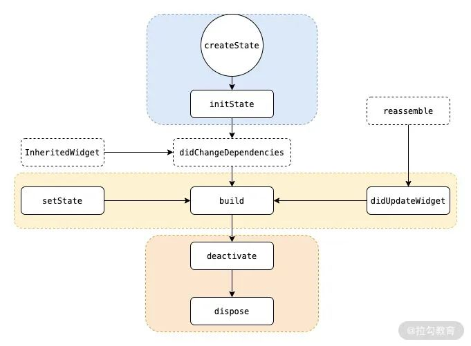
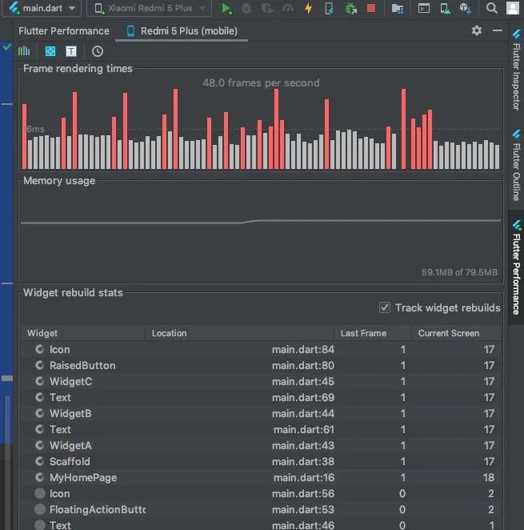
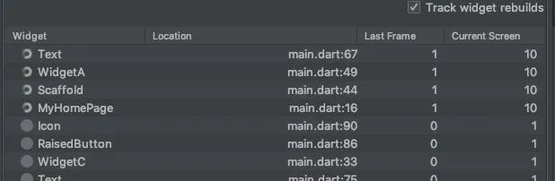

# Flutter 组件的生命周期、State 管理及局部重绘 | 开发者说·DTalk

## **生命周期**

[Flutter](https://google.blog.csdn.net/article/details/125942000?spm=1001.2014.3001.5502) 的[生命周期](https://so.csdn.net/so/search?q=生命周期&spm=1001.2101.3001.7020)其实有两种: StatefulWidget 和 StatelessWidget。

这两个是 [Flutter](https://so.csdn.net/so/search?q=Flutter&spm=1001.2101.3001.7020) 的两个基本组件，名称已经很好表明了这两个组件的功能: 有状态和无状态。

### **StatelessWidget**

StatelessWidget 是无状态组件，它的生命周期非常简单，只有一个 build，如下:

```java
class WidgetA extends StatelessWidget {
  @override
  Widget build(BuildContext context) {
    return ...;
  }
}
```

对于 StatelessWidget 来说只渲染一次，之后它就不再有任何改变。

> 由于无状态组件在执行过程中只有一个 build 阶段，在执行期间只会执行一个 build 函数，没有其他生命周期函数，**因此在执行速度和效率方面比有状态组件更好。所以在设计组件时，要考虑业务情况，尽量使用无状态组件。**

### **StatefulWidget**

StatefulWidget 是有状态组件，我们讨论的生命周期也基本指它的周期，如图:



包含以下几个阶段:

- createState 

  该函数为 StatefulWidget 中创建 State 的方法，当 StatefulWidget 被调用时会立即执行 createState。

- initState 

  该函数为 State 初始化调用，**因此可以在此期间执行 State 各变量的初始赋值，同时也可以在此期间与服务端交互**，获取服务端数据后调用 setState 来设置 State。

- didChangeDependencies

  该函数是在该组件依赖的 State 发生变化时，这里说的 State 为全局 State，例如语言或者主题等，类似于前端 Redux 存储的 State。

- build

  主要是返回需要渲染的 Widget，**由于 build 会被调用多次，因此在该函数中只能做返回 Widget 相关逻辑，避免因为执行多次导致状态异常，注意这里的性能问题。**

- reassemble

  主要是提供开发阶段使用，在 debug 模式下，每次热重载都会调用该函数，因此在 debug 阶段可以在此期间增加一些 debug 代码，来检查代码问题。

- didUpdateWidget

  该函数主要是在组件重新构建，比如说热重载，父组件发生 build 的情况下，子组件该方法才会被调用，其次该方法调用之后一定会再调用本组件中的 build 方法。

- deactivate

  在组件被移除节点后会被调用，如果该组件被移除节点，然后未被插入到其他节点时，则会继续调用 dispose 永久移除。

- dispose

  永久移除组件，并释放组件资源。

在 StatelessWidget 中，只要我们调用 setState，就会执行重绘，也就是说重新执行 build 函数，这样就可以改变 UI。

### **State 改变时组件如何刷新**

先来看看下方的代码:

```java
class MyHomePage extends StatefulWidget {
 
 
  @override
  _MyHomePageState createState() => _MyHomePageState();
}
 
 
class _MyHomePageState extends State<MyHomePage> {
  int _counter = 0;
 
 
  void _incrementCounter() {
    setState(() {
      _counter++;
    });
  }
 
 
  @override
  Widget build(BuildContext context) {
    return Scaffold(
      body: Center(
        child: Column(
          mainAxisAlignment: MainAxisAlignment.center,
          children: [
            WidgetA(_counter),
            WidgetB(),
            WidgetC(_incrementCounter)
          ],
        ),
      ),
    );
  }
}
 
 
class WidgetA extends StatelessWidget {
  final int counter;
 
 
  WidgetA(this.counter);
 
 
  @override
  Widget build(BuildContext context) {
    return Center(
      child: Text(counter.toString()),
    );
  }
}
 
 
class WidgetB extends StatelessWidget {
  @override
  Widget build(BuildContext context) {
    return Text('I am a widget that will not be rebuilt.');
  }
}
 
 
class WidgetC extends StatelessWidget {
  final void Function() incrementCounter;
 
 
  WidgetC(this.incrementCounter);
 
 
  @override
  Widget build(BuildContext context) {
    return RaisedButton(
      onPressed: () {
        incrementCounter();
      },
      child: Icon(Icons.add),
    );
  }
}
```

我们有三个 Widget，一个负责显示 count，一个按钮改变 count，一个则是静态显示文字，通过这三个 Widget 来对比比较页面的刷新逻辑。

上面代码中，三个 Widget 是在 _MyHomePageState 的 build 中创建的，执行后点击按钮可以发现三个 Widget 都刷新了。

在 Flutter Performance 面板上选中 Track Widget Rebuilds 即可看到



虽然三个 Widget 都是无状态的 StatelessWidget，但是因为 _MyHomePageState 的 State 改变时会重新执行 build 函数，所以三个 Widget 会重新创建，这也是为什么 WidgetA 虽然是无状态的 StatelessWidget 却依然可以动态改变的原因。

**所以: 无状态的 StatelessWidget 并不是不能动态改变，只是在其内部无法通过 State 改变，但是其父 Widget 的 State 改变时可以改变其构造参数使其改变。实际上确实不能改变，因为是一个新的实例。**

下面我们将三个组件提前创建，可以在 _MyHomePageState 的构造函数中创建，修改后代码如下:

```java
class _MyHomePageState extends State<MyHomePage> {
  int _counter = 0;
  List<Widget> children;
 
 
  _MyHomePageState(){
    children = [
      WidgetA(_counter),
      WidgetB(),
      WidgetC(_incrementCounter)
    ];
  }
 
 
  void _incrementCounter() {
    setState(() {
      _counter++;
    });
  }
 
 
  @override
  Widget build(BuildContext context) {
    return Scaffold(
      body: Center(
        child: Column(
          mainAxisAlignment: MainAxisAlignment.center,
          children: children,
        ),
      ),
    );
  }
}
```

再次执行，发现点击没有任何效果，Flutter Performance 上可以看到没有 Widget 刷新 (这里指三个 Widget，当然 Scaffold 还是刷新了)。

这是因为组件都提前创建了，所以执行 build 时没有重新创建三个 Widget，所以 WidgetA 显示的内容并没有改变，因为它的 counter 没有重新传入。

**所以，不需要动态改变的组件可以提前创建，build 时直接使用即可，而需要动态改变的组件实时创建。**

这样就可以实现局部刷新了么？我们继续改动代码如下:

```properties
class _MyHomePageState extends State<MyHomePage> {
  int _counter = 0;
  Widget b = WidgetB();
  Widget c ;
 
 
  _MyHomePageState(){
    c = WidgetC(_incrementCounter);
  }
 
 
  void _incrementCounter() {
    setState(() {
      _counter++;
    });
  }
 
 
  @override
  Widget build(BuildContext context) {
    return Scaffold(
      body: Center(
        child: Column(
          mainAxisAlignment: MainAxisAlignment.center,
          children: [
            WidgetA(_counter),
            b,
            c
          ],
        ),
      ),
    );
  }
}
```

我们只将 WidgetB 和 WidgetC 重新创建，而 WidgetA 则在 build 中创建。执行后，点击按钮 WidgetA 的内容改变了，查看 Flutter Performance 可以看到只有 WidgetA 刷新了，WidgetB 和 WidgetC 没有刷新。



**所以: 通过提前创建静态组件 build 时直接使用，而 build 时直接创建动态 Widget 这种方式可以实现局部刷新。**

**注意:** **只要 setState，_MyHomePageState 就会刷新，所以 WidgetA 就会跟着刷新**，即使 count 没有改变。比如上面代码中将 setState 中的 _count++ 代码注释掉，再点击按钮虽然内容没有改变，但是 WidgetA 依然刷新。

这种情况可以通过 InheritedWidget 来进行优化。

### **InheritedWidget**

InheritedWidget 的作用什么？网上有人说是数据共享，有人说是用于局部刷新。我们看官方的描述:

> Base class for widgets that efficiently propagate information down the tree.

可以看到它的作用是 Widget 树从上到下有效的传递消息，所以很多人理解为数据共享，但是注意这个 "有效的"，这个才是它的关键，而这个有效的其实就是解决上面提到的问题。

那么它怎么使用？

先创建一个继承至 InheritedWidget 的类:

```java
class MyInheriteWidget extends InheritedWidget{
  final int count;
  MyInheriteWidget({@required this.count, Widget child}) : super(child: child);
 
 
  static MyInheriteWidget of(BuildContext context) {
    return context.dependOnInheritedWidgetOfExactType<MyInheriteWidget>();
  }
 
 
  @override
  bool updateShouldNotify(MyInheriteWidget oldWidget) {
    return oldWidget.count != count;
  }
}
```

这里将 count 传入。重点注意要实现 updateShouldNotify 函数，通过名字可以知道这个函数决定 InheritedWidget 的 Child Widget 是否需要刷新，这里我们判断如果与之前改变了才刷新。这样就解决了上面提到的问题。

然后还要实现一个 static 的 of 方法，用于 Child Widget 中获取这个 InheritedWidget，这样就可以访问它的 count 属性了，这就是消息传递，即所谓的数据共享 (因为 InheritedWidget 的 child 可以是一个 layout，里面有多个 widget，这些 widget 都可以使用这个 InheritedWidget 中的数据)。

然后我们改造一下 WidgetA:

```java
class WidgetA extends StatelessWidget {
 
 
  @override
  Widget build(BuildContext context) {
    final MyInheriteWidget myInheriteWidget = MyInheriteWidget.of(context);
    return Center(
      child: Text(myInheriteWidget.count.toString()),
    );
  }
}
```

这次不用在构造函数中传递 count 了，直接通过 of 获取 MyInheriteWidget，使用它的 count 即可。

最后修改 _MyHomePageState:

```properties
class _MyHomePageState extends State<MyHomePage> {
  int _counter = 0;
  Widget a = WidgetA();
  Widget b = WidgetB();
  Widget c ;
 
 
  _MyHomePageState(){
    c = WidgetC(_incrementCounter);
  }
 
 
  void _incrementCounter() {
    setState(() {
      _counter++;
    });
  }
 
 
  @override
  Widget build(BuildContext context) {
    return Scaffold(
      body: Center(
        child: Column(
          mainAxisAlignment: MainAxisAlignment.center,
          children: [
            MyInheriteWidget(
              count: _counter,
              child: a,
            ),
            b,
            c
          ],
        ),
      ),
    );
  }
}
```

注意，这里用 MyInheriteWidget 包装一下 WidgetA，**而且 WidgetA 必须提前创建，如果在 build 中创建则每次 MyInheriteWidget 刷新都会跟着刷新，这样 updateShouldNotify 函数的效果就无法达到。**

执行，点击按钮，可以发现只有 WidgetA 刷新了 (当然 MyInheriteWidget 也刷新了)。如果注释掉 setState 中的 _count++ 代码，再执行并点击发现虽然 MyInheriteWidget 刷新了，但是 WidgetA 并不刷新，因为 MyInheriteWidget 的 count 并未改变。

下面我们改动一下代码，将 WidgetB 和 C 都放入 MyInheriteWidget 会怎样？

```properties
@override
  Widget build(BuildContext context) {
    return Scaffold(
      body: Center(
        child: Column(
          mainAxisAlignment: MainAxisAlignment.center,
          children: [
            MyInheriteWidget(
              count: _counter,
              child: Column(
                children: [
                  a,
                  b,
                  c
                ],
              ),
            ),
          ],
        ),
      ),
    );
  }
}
```

MyInheriteWidget 的 child 是一个 Column，将 a、b、c 都放在这下面。执行会发现依然是 WidgetA 刷新，B 和 C 都不刷新。这是因为在 B 和 C 中没有执行 MyInheriteWidget 的 of 函数，就没有执行 dependOnInheritedWidgetOfExactType，这样其实就没构成依赖，MyInheriteWidget 就不会通知它们。

如果我们修改 WidgetC，在 build 函数中添加一行 MyInheriteWidget.of(context); 那么虽然没有任何使用，依然会跟着刷新，因为建立了依赖关系就会被通知。

InheritedWidget 会解决多余的刷新问题，比如在一个页面中有多个属性，同样有多个 Widget 来使用这些属性，但是并不是每个 Widget 都使用所有属性。如果用最普通的实现方式，那么每次 setState (无论改变哪个属性) 都需要刷新这些 Widget。但是如果我们用多个 InheritedWidget 来为这些 Widget 分类，使用相同属性的用同一个 InheritedWidget 来包装，并实现 updateShouldNotify，这样当改变其中一个属性时，只有该属性相关的 InheritedWidget 才会刷新它的 child，这样就提高了性能。

### **InheritedModel**

InheritedModel 是继承至 InheritedWidget 的，扩充了它的功能，所以它的功能更加强大。具体提现在哪里呢？

通过上面我们知道，InheritedWidget 可以通过判断它的 data 是否变化来决定是否刷新 child，但是实际情况下这个 data 可以是多个变量或者一个复杂的对象，而 child 也不是单一 widget，而是一系列 widget 组合。比如展示一本书，数据可能有书名、序列号、日期等等，但是每个数据可能单独变化，如果用 InheritedWidget，每种数据就需要一个 InheritedWidget 类，然后将使用该数据的 widget 包装，这样才能包装改变某个数据时其他 widget 不刷新。

但是这样的问题就是 widget 层级更加复杂混乱，InheritedModel 就可以解决这个问题。InheritedModel 最大的功能就是根据不同数据的变化刷新不同的 widget。下面来看看如何实现。

首先创建一个 InheritedModel:

```java
class MyInheriteModel extends InheritedModel<String>{
  final int count1;
  final int count2;
  MyInheriteModel({@required this.count1, @required this.count2, Widget child}) : super(child: child);
 
 
  static MyInheriteModel of(BuildContext context, String aspect){
    return InheritedModel.inheritFrom(context, aspect: aspect);
  }
 
 
  @override
  bool updateShouldNotify(MyInheriteModel oldWidget) {
    return count1 != oldWidget.count1 || count2 != oldWidget.count2;
  }
 
 
  @override
  bool updateShouldNotifyDependent(MyInheriteModel oldWidget, Set<String> dependencies) {
    return (count1 != oldWidget.count1 && dependencies.contains("count1")) ||
        (count2 != oldWidget.count2 && dependencies.contains("count2"));
  }
}
```

这里我们传入两个 count，除了实现 updateShouldNotify 方法，还需要实现 updateShouldNotifyDependent 方法。这个函数就是关键，可以看到我们判断某个数据是否变化后还判断了 dependencies 中是否包含一个关键词:

```nginx
count1 != oldWidget.count1 && dependencies.contains("count1")
```

这个关键词是什么？从哪里来？后面会提到，这里先有个印象。

然后同样需要实现一个 static 的 of 函数来获取这个 InheritedModel，不同的是这里获取的代码变化了:

```css
InheritedModel.inheritFrom(context, aspect: aspect);
```

这里的 aspect 就是后面用到的关键字，而 inheritFrom 会将这个关键字放入 dependencies，以便 updateShouldNotifyDependent 来使用。后面会详细解释这个 aspect 完整作用。

然后我们改造 WidgetA:

```java
class WidgetA extends StatelessWidget {
 
 
  @override
  Widget build(BuildContext context) {
    final MyInheriteModel myInheriteModel = MyInheriteModel.of(context, "count1");
    return Center(
      child: Text(myInheriteModel.count1.toString()),
    );
  }
}
```

可以看到，这里定义了 aspect。

然后因为有两个 count，所以我们再新增两个 Widget 来处理 count2:

```java
class WidgetD extends StatelessWidget {
 
 
  @override
  Widget build(BuildContext context) {
    final MyInheriteModel myInheriteModel = MyInheriteModel.of(context, "count2");
    return Center(
      child: Text(myInheriteModel.count2.toString()),
    );
  }
}
 
 
class WidgetE extends StatelessWidget {
  final void Function() incrementCounter;
 
 
  WidgetE(this.incrementCounter);
 
 
  @override
  Widget build(BuildContext context) {
    return RaisedButton(
      onPressed: () {
        incrementCounter();
      },
      child: Icon(Icons.add),
    );
  }
}
```

这里可以看到 WidgetD 的 aspect 与 WidgetA 是不同的。

最后修改 _MyHomePageState:

```properties
class _MyHomePageState extends State<MyHomePage> {
  int _counter = 0;
  int _counter2 = 0;
  Widget a = Row(
    children: [
      WidgetA(),
      WidgetD()
    ],
  );
  Widget b = WidgetB();
  Widget c ;
  Widget e ;
 
 
  _MyHomePageState(){
    c = WidgetC(_incrementCounter);
    e = WidgetE(_incrementCounter2);
  }
 
 
  void _incrementCounter() {
    setState(() {
      _counter++;
    });
  }
 
 
  void _incrementCounter2() {
    setState(() {
      _counter2++;
    });
  }
 
 
  @override
  Widget build(BuildContext context) {
    return Scaffold(
      body: Center(
        child: Column(
          mainAxisAlignment: MainAxisAlignment.center,
          children: [
            MyInheriteModel(
              count1: _counter,
              count2: _counter2,
              child: a,
            ),
            b,
            c,
            e
          ],
        ),
      ),
    );
  }
}
```

WidgetD 和 E 是处理 count2 的，A 和 C 则是处理 count。而 MyInheriteModel 的 child 不是单一 Widget，而是一个 Row，包含 WidgetD 和 A。

执行代码，可以发现点击 WidgetC 的时候，只有 WidgetA 刷新了 (当然 MyInheriteModel 也刷新)；而点击 WidgetD 的时候，只有 WidgetE 刷新了。这样我们就实现了 MyInheriteModel 中的局部刷新。

其实原理很简单，aspect 就相当于一个标记，当我们通过 InheritedModel.inheritFrom(context, aspect: aspect); 获取 MyInheriteModel 时，实际上将本 Widget 依赖到 MyInheriteModel，并且将这个 Widget 标记。这时候如果 data 改变，遍历它的所有依赖时，会通过每个依赖的 Widget 获取它对应的标记集 dependencies，然后触发 updateShouldNotifyDependent 判断该 Widget 是否刷新。

**所以在 InheritedModel (其实是 InheritedElement) 中存在一个 map，记录了每个依赖的 Widget 对应的 dependencies，所以一个 Widget 可以有多个标记，因为 dependencies 是一个 Set，这样就可以响应多个数据的变化 (比如多个数据组成一个 String 作为文本显示)。**

上面其实可以用两个 InheritedWidget 也可以实现，但是布局越复杂，就需要越多的 InheritedWidget，维护起来也费时费力。

所以可以看到 InheritedModel 使用更灵活，功能更强大，更适合复杂的数据和布局使用，并且通过细分细化每一个刷新区域，使得每次刷新都只更新最小区域，极大的提高了性能。

## **InheritedNotifier**

InheritedNotifier 同样继承至 InheritedWidget，它是一个给 Listenable 的子类的专用工具，它的构造函数中要传入一个 Listenable (这是一个接口，不再是之前的各种数据 data)，比如动画 (如 AnimationController)，然后其依赖的组件则根据 Listenable 进行更新。

首先还是先创建一个 InheritedNotifier:

```java
class MyInheriteNotifier extends InheritedNotifier<AnimationController>{
  MyInheriteNotifier({
       Key key,
       AnimationController notifier,
       Widget child,
     }) : super(key: key, notifier: notifier, child: child);
 
 
  static double of(BuildContext context){
    return context.dependOnInheritedWidgetOfExactType<MyInheriteNotifier>().notifier.value;
  }
}
```

这里提供的 of 函数则直接返回 AnimationController 的 value 即可。

然后创建一个 Widget:

```java
class Spinner extends StatelessWidget {
  @override
  Widget build(BuildContext context) {
    return Transform.rotate(
      angle: MyInheriteNotifier.of(context) * 2 * pi,
      child: Text("who!!"),
    );
  }
}
```

内容会根据 AnimationController 进行旋转。

修改 WidgetA:

```java
class WidgetA extends StatelessWidget {
 
 
  @override
  Widget build(BuildContext context) {
    return Center(
      child: Text("WidgetA"),
    );
  }
}
```

然后修改 _MyHomePageState:

```properties
class _MyHomePageState extends State<MyHomePage6> with SingleTickerProviderStateMixin {
  AnimationController _controller;
 
 
  @override
  void initState() {
    super.initState();
    _controller = AnimationController(
      vsync: this,
      duration: Duration(seconds: 10),
    )..repeat();
  }
 
 
  @override
  Widget build(BuildContext context) {
    return Scaffold(
      body: Center(
        child: Column(
          mainAxisAlignment: MainAxisAlignment.center,
          children: [
            WidgetA(),
            MyInheriteNotifier(
                notifier: _controller,
                child: Spinner()
            ),
          ],
        ),
      ),
    );
  }
}
```

运行会看到 Text 在不停的旋转，当然如果有其他 Widget 可以看到并不跟着刷新。

总之 InheritedNotifier 是一个更细化的工具，聚焦到一个具体场景中，使用起来也更方便。

### **Notifier**

最后再简单介绍一下 Notifier，考虑一个需求: 页面 A 是列表页，而页面 B 是详情页，两个页面都有点赞操作和显示点赞数量，需要在一个页面点赞后两个页面的数据同时刷新。这种情况下就可以使用 Flutter 提供另外一种方式 —— Notifier。

Notifier 其实就是订阅模式的实现，主要包含 ChangeNotifier 和 ValueNotifier，使用起来也非常简单。通过 addListener 和 removeListener 进行订阅和取消订阅 (参数是无参无返回值的 function)，当数据改变时调用 notifyListeners(); 通知即可。

ValueNotifier 是更简单的 ChangeNotifier，只有一个数据 value，可以直接进行 set 和 get，set 时自动执行 notifyListeners()，所以适合单数据的简单场景。

当时注意 Notifier 只是共享数据并通知变化，并不实现刷新，所以还要配合其他一并实现。比如上面的 InheritedNotifier (因为 Notifier 都继承 Listenable 接口，所以两个可以很简单的配合使用)，或者第三方库 Provider (web 开发的习惯) 等等。