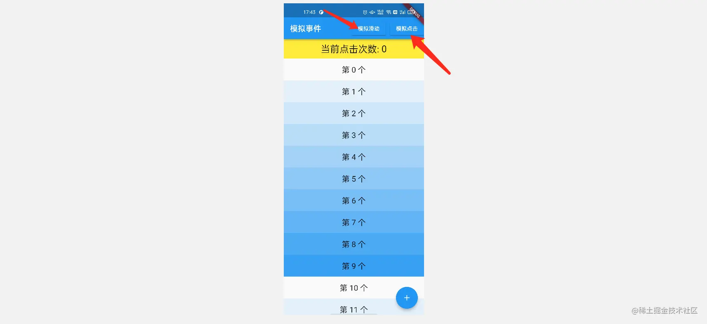
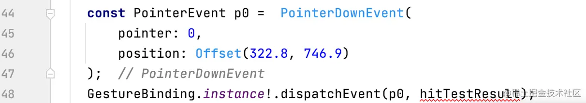
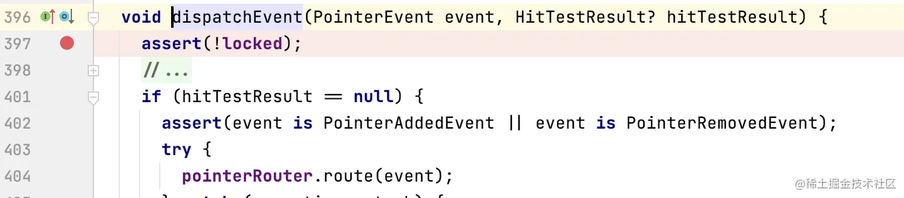
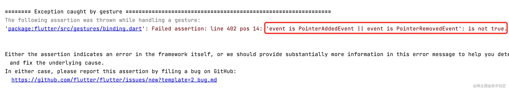
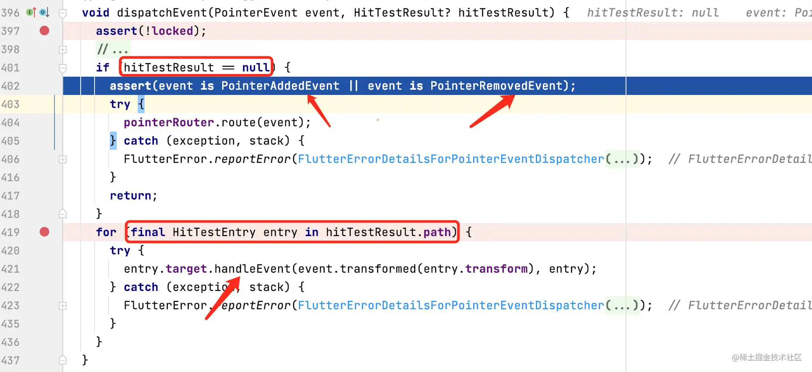
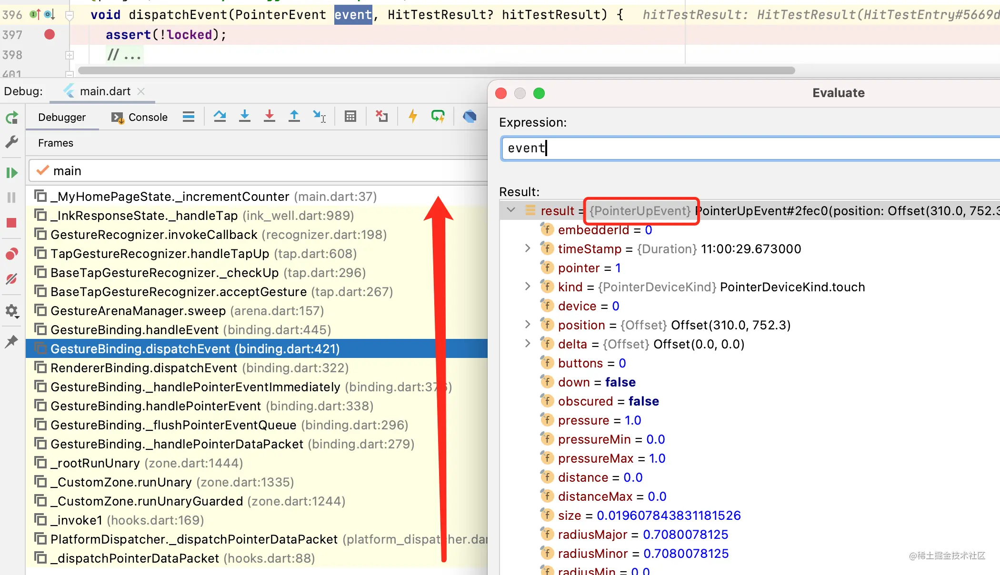
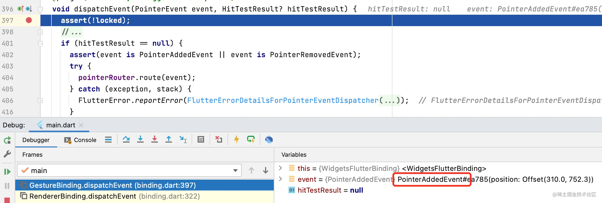

# 探索 Flutter 模拟事件触发 | 开发者说·DTalk

如果可以模拟 `PointerEvent` 进行分发，那么在应用中就可以通过 `代码` 来触发手势事件，这样就能解放双手。如果结合语音监听，通过代码处理，说话也能触发手势操作，岂不美哉。

作为探索完 `手势机制` 和 `滑动机制` ，又有完成这两本小册的我，感觉这个问题应该可解。下面就将整个问题的解决过程进行梳理，带大家再认识一下手势底层的相关实现。

------

#### 一、模拟按下事件

##### 1. 思路分析1

`PointerEvent` 作为手势机制中被`传递的数据`，它记录着触点的 `id` ，`坐标` 、`触点类型`  等信息。所以如果有办法发送一个 `PointerDownEvent` 的消息，不就表示按下了吗？


------

##### 2. 自己分发事件

然后想到手势事件分发是由 `GestureBinding` 处理的，而我们可以通过 `GestureBinding.instance` 获取 `GestureBinding` 对象。那是不是意味着，可以自己来分发一个  `PointerDownEvent` 的消息。于是创建如下示例界面：上部有两个按钮分别用于 `模拟滑动` 和 `模拟点击`。



我们现在的目标是通过 `模拟点击` 可以点击右下角的加号按钮，从而让上面黄色区域内的数字自加；通过 `模拟滑动` 让列表滑动。

------


于是写了如下 `48` 行的代码通过 `GestureBinding` 对象的 `dispatchEvent` 来分发事件：




现在问题来了，第二入参需要传入 `HitTestResult` 对象。




但它是一个可空的入参，所以传个 `null` 试试：

```dart
GestureBinding.instance!.dispatchEvent(p0, null);
```

很不出所料地，抛了异常，看来这样直接发送消息似乎并不是正解。那么来分析一下这样为何不可。



------


##### 3. GestureBinding#dispatchEvent 的逻辑处理

下面通过调试来看一下 `GestureBinding#dispatchEvent` 的逻辑处理：`402` 行表示，当 `hitTestResult` 为 `null` 时，当前的 `event` 对象类型必须是 `PointerAddedEvent` 和 `PointerRemovedEvent` 。而我们上面传入 `PointerDownEvent` ，使用肯定会抛异常。



所以现在的问题是，如果我们无法创建 `HitTestResult` ，就无法通过 `dispatchEvent` 方法来分发 `PointerDownEvent` 事件。但 `HitTestResult` 是从 `hitTest` 收集的，我们似乎很难去主动创建，似乎问题进入了死胡同。

------


#### 二、单击事件是如何触发的

##### 1. 回顾单击事件的触发

如下是点击加好按钮时  `FloatingActionButton#onPressed` 回调触发的方法栈情况，可以看到是在分发 `PointerUpEvent` 类型事件下触发单击事件的：




其实这也很好理解，在 《[Flutter 手势探索 - 执掌天下](https://juejin.cn/book/6896378716427911181/section)》中介绍过单击事件的触发：一个单击事件的触发条件并非只是分发 `PointerDownEvent` 而已，`TapGestureRecognizer` 手势检测器至少需要按下、抬起才会被触发。

所有我们可以在 `GestureBinding#dispatchEvent` 分发方法打个断点，通过点击 `+` 按钮，看看有哪些 `PointerDownEvent` 会被分发。

------

##### 2. 单击事件分发的 PointerEvent

如下所示，首先会分发 `PointerAddEvent` 事件，此时 `hitTestResult` 为 `null`，




接下来分发 `PointerDownEvent` 事件，可以看出此时 `hitTestResult` 就已经非空了，这说明在分发 `PointerAddEvent` 事件后，分发 `PointerDownEvent` 事件前，肯定有对 `HitTestResult` 进行收录的处理。


最后分发  `PointerDownEvent` 事件，然后就出发了单击事件的回调。


------

##### 3. HitTestResult 的收集

那接下来看一下 `PointerDownEvent` 事件分发分发前， `HitTestResult` 是如何被收集的。其实想知道这点很简单，`dispatchEvent` 既然要传入 `HitTestResult` 对象，只要通过调试看一下这个对象的来源即可：
 只要往下看两个方法栈，很容易定位到在 `GestureBinding._handlePointerEventImmediately` 方法中当 `event` 是 `PointerDownEvent` 、`PointerSignalEvent`、`PointerHoverEvent` 时，都会创建 `HitTestResult` 对象，在通过 `hitTest` 方法来收集测试结果。


至于  `hitTest` 方法是如何从顶层的 `RenderView` 一层层测试的，这里就不展开了。感兴趣的可以自己调试看看，另外在 《[Flutter 手势探索 - 执掌天下](https://juejin.cn/book/6896378716427911181/section)》的最后一章也有介绍。
 其实这样一来，我们如何可以触发这个方法就好了，但可惜它是个私有成员方法。但我们眼睛可以稍微向下瞄一个方法栈，普通成员方法 `GestureBinding.handlePointerEvent` 可以触发这个私有方法。到这里，一个解决方案就应运而生了。


------

#### 三、模拟事件触发的实现

如下效果所示：通过 `模拟点击` 可以点击右下角的加号按钮，从而让上面黄色区域内的数字自加；通过 `模拟滑动` 让列表滑动。这样我们就实现了`通过代码`来`触发手势事件` 。

|                                                              |                                                              |
| ------------------------------------------------------------ | ------------------------------------------------------------ |
|  |  |

##### 1. 单击事件

其实我们只需要通过 `GestureBinding#handlePointerEvent` 依次分发这三个 `PointerEvent` ，就能模拟单击事件的触发了。没错，就是这么简单，但其中涉及到的手势体系知识，还是很值得回味的。
 `*注`：其中 `Offset(322.8, 746.9)`  是触点的位置，是刚才通过调试看到的 `+ ` 位置。

```dart
void _pressAdd() {
  const PointerEvent addPointer =  PointerAddedEvent(
      pointer: 0,
      position: Offset(322.8, 746.9)
  );
      const PointerEvent downPointer =  PointerDownEvent(
      pointer: 0,
      position: Offset(322.8, 746.9)
  );
  const PointerEvent upPointer =  PointerUpEvent(
      pointer: 0,
      position: Offset(322.8, 746.9)
  );
  GestureBinding.instance!.handlePointerEvent(addPointer);
  GestureBinding.instance!.handlePointerEvent(downPointer);
  GestureBinding.instance!.handlePointerEvent(upPointer);
}
复制代码
```

------

##### 2. 滑动事件的触发

如下，滑动事件的触发关键点在于 `tag1` 处，通过 `for` 循环模拟 `20 次` 偏移量是 `20` 的向上滑动事件。

```dart
void _pressMove() async {
  const PointerEvent addPointer =  PointerAddedEvent(
      pointer: 1,
      position: Offset(122.8, 746.9)
  );
  const PointerEvent downPointer =  PointerDownEvent(
      pointer: 1,
      position: Offset(122.8, 746.9)
  );
  GestureBinding.instance!.handlePointerEvent(addPointer);
  GestureBinding.instance!.handlePointerEvent(downPointer);
  
  double dy = 20;
  double updateCount = 20;
  for (int i = 0; i < 20; i++) { // tag1
    await Future.delayed(const Duration(milliseconds: 6));
    PointerEvent movePointer =  PointerMoveEvent(
        pointer: 1,
        delta: Offset(0, -dy),
        position: Offset(122.8, 746.9 - i * dy)
    );
    GestureBinding.instance!.handlePointerEvent(movePointer);
  }
  
  PointerEvent upPointer = PointerUpEvent(
      pointer: 1,
      position: Offset(122.8, 746.9 - dy * updateCount)
  );
  GestureBinding.instance!.handlePointerEvent(upPointer);
}
复制代码
```

这样就可以发现：只要我们按照各手势检测器竞技胜利的规则进行模拟处理 `PointerEvent` 事件，就可以`通过代码`完成我们想要触发的手势，是不是感觉非常棒。感觉可以结合一下 `计时器` 通过发送 `一系列手势` 来完成一些引导操作，或者操作演示。

对于一些流程性的测试，或`精准的滑动控制分析` ，用代码模拟会显得更加重要，因为一些性能分析需要控制变量，手动滑动多多少少会有不同，从而影响测试分析的结果。[A 少](https://juejin.cn/user/606586150596360) 也是因此才提出这个问题，那本篇就到这里，希望通过本文你能对 Flutter 的手势有更深切的认识，也希望 Flutter 模拟事件触发，在某个时刻可以帮助到你 ~


作者：张风捷特烈
链接：https://juejin.cn/post/7057680571157184549
来源：稀土掘金
著作权归作者所有。商业转载请联系作者获得授权，非商业转载请注明出处。